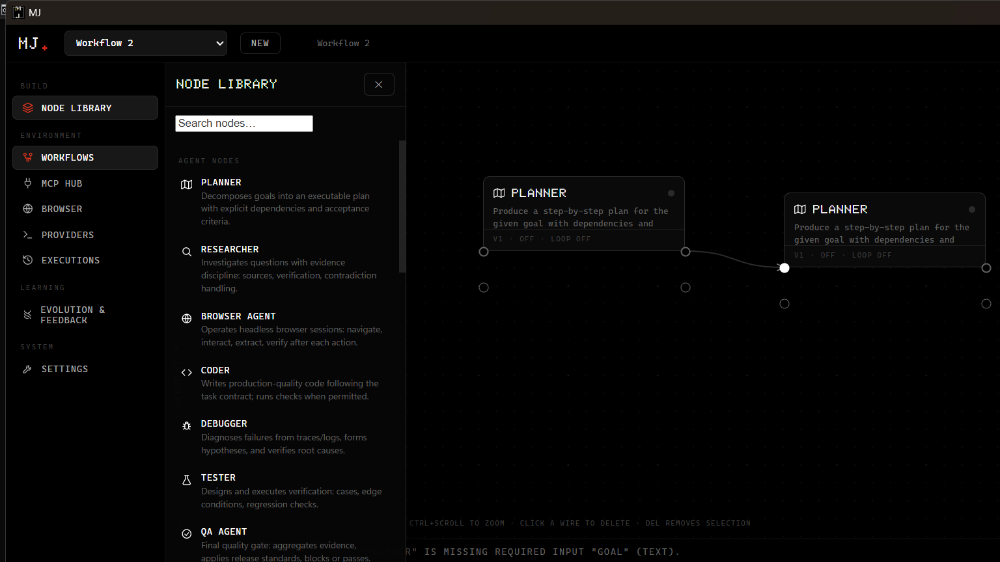
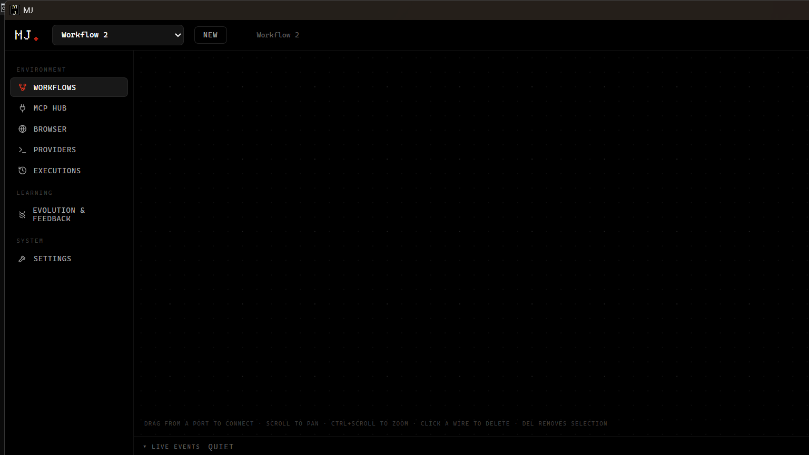
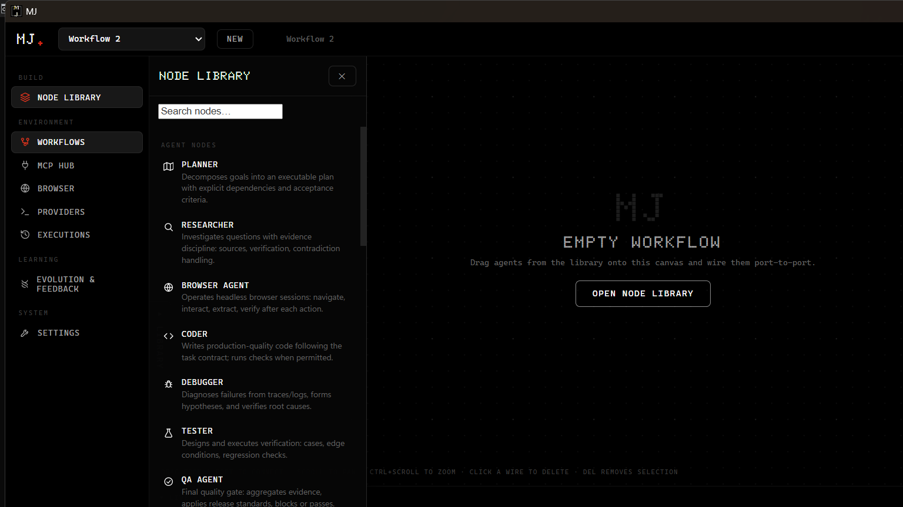
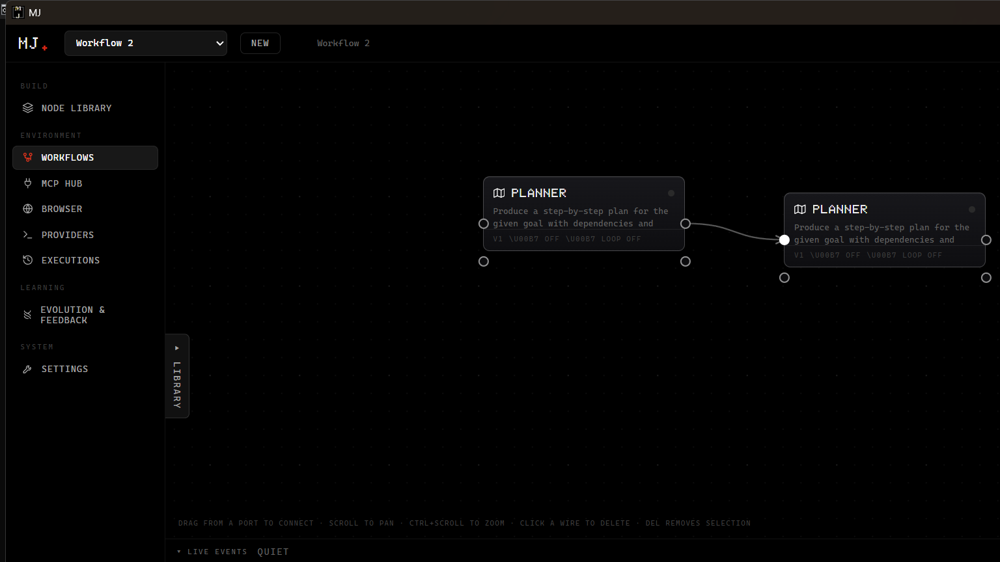

# MJ — Agent Organization Runtime

A desktop app for running agent organisations. Not a workflow builder with AI bolted on.

> I kept running into workflows that *looked* successful but weren't. MJ is my take on fixing that — you give it an outcome, it plans the work, picks the right agent for each task, actually checks if it worked, and remembers why.



### Screenshots

| Empty canvas | Node Library |
|---|---|
|  |  |
| Dotted grid, hint `DRAG FROM A PORT...` — start blank, no demo data | Planner, Researcher, Browser, Coder, Debugger, Tester, QA — search and drag onto canvas |

| Wired workflow | With library closed |
|---|---|
|  |  |
| Two Planners wired port-to-port | Same graph, library collapsed — canvas is the source of truth |

*Tauri desktop build (OLED, frameless). Browser fallback renders the same shell.*

---

### What it does

- **Mission owns the org, not the other way around.** The plan is the source of truth — MJ forms the team from it.
- **25 harnesses, no lock-in.** Works with claude, codex, gemini, grok, cursor, opencode, amp, auggie, warp ... 23 CLIs + hermes + llm. Each has a researched install + argv. The policy that builds the argv comes from the same registry, so they can't drift.
- **Teams that actually review.** Writers work in worktrees, reviewers get a snapshot of the writers' branches — they review what was written, not the base.
- **Checks what matters.** Cost/tokens come from the CLI's own NDJSON or it's `unmeasured` — never `chars/4`. Sandbox wrappers are proven with canaries that *must* fail, verdicts are exit-code first.
- **Local first.** SQLite, OS keychain for secrets, child processes over stdio. No sidecar HTTP. Ollama at `127.0.0.1:11434` is yours if you have it.

### Stack

Tauri v2 (Rust 1.80) + React 18 / Vite 6 / TypeScript 5.6 / Zustand on top, Python `vendor/evolution-service` (`mj_evolution.stdio_server`) for the evolve loop. Vanilla CSS, self-hosted fonts.

### Run it

```bash
# Node 22 + Rust stable (WebKit/GTK on Linux)
npm ci
npm run typecheck   # tsc --noEmit
npm test            # 40 suites
npm run build       # vite build

# dev
npm run tauri dev
npm run tauri:build   # nsis / dmg / appimage

# quick check without node_modules (~25s)
node verify/run.mjs
```

### Layout

```
src/         # React — pages, canvas, mission runtime, domain/harness, engines
src-tauri/   # 92 Tauri commands, SQLite, keyring, MCP/ACP bridges, evolution-service, git
probe/       # 40 suites (40/40)
verify/      # offline pack — 39 bundles + runner, byte-pinned
vendor/      # mcp-servers-reference, mcp-github, evolution-service (hermes-agent + its self-evolution agent de-vendored in 11.9)
docs/        # history + verification
```

### Tests

`npm test` does 40 suites — harnesses 270 assertions (the `iff` on turn-flags for all 25), checkRunner, sandbox, theme, canvasGeometry, etc. There's a typed `MjCommands` in `src/ipc/client.ts` so a renamed Rust command is a compile error, not a runtime surprise.

`node verify/run.mjs` is the reviewer gate — same suites as bundles, no install.

More in `docs/VERIFICATION.md` and `verify/BUILD-INFO.txt`.

### History

5.0 → 11.9.2 over about a year. Biggest fixes: vacuous gate (args reversed), turn-flag drift, wrapper `EACCES` mis-classified as enforced, browser `require('fs')` that broke in ESM, shipping the vendored engines, then typing the whole Rust↔TS boundary and killing every `as never` in `src/`. 11.9 then de-vendored the Hermes agent engines, shipped the minimal/unique **NTH** theme (obsidian ground, electro-violet volt, plasma pulse — no gimmicky motion), and fixed the four canvas integrity bugs the review found: wires now land on their port anchors via rendered bounding-box measurement, overlapping cards own their stacking contexts, ports are inset into the card edge, and agent cards are a consistent `264px`.

Short version in `CHANGELOG.md`, full notes in `docs/history/`.

### Docs & License

- Setup: `DESKTOP-NATIVE.md` / `BUILD-NATIVE.md` / `INSTALL-ON-LAPTOP.md`
- What MJ wraps: `VENDOR.md` · `NOTICE`

Source-available under **PolyForm Noncommercial 1.0.0** — free to run and study, not for commercial products or AI training. See `LICENSE`. Want to use it commercially? Open an issue.

---

Built by **Sree Harshen** — MJ is a real desktop app we ship. Feedback and PRs welcome.
