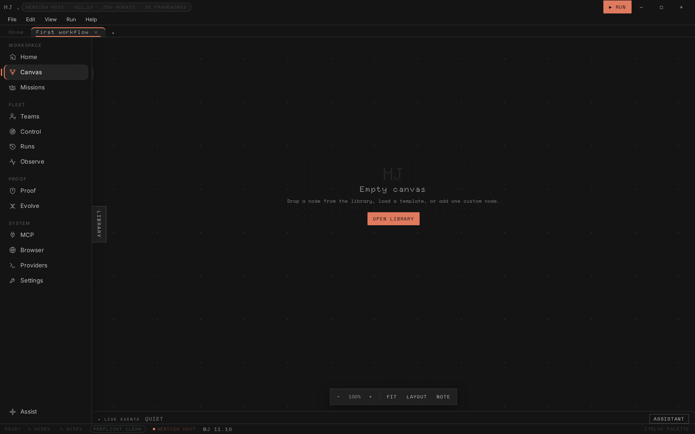
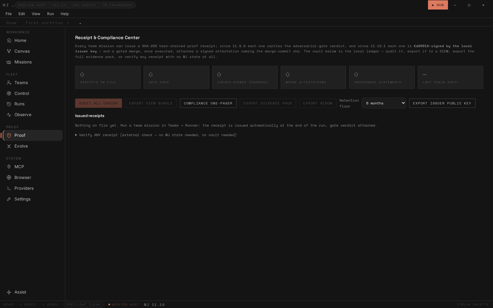
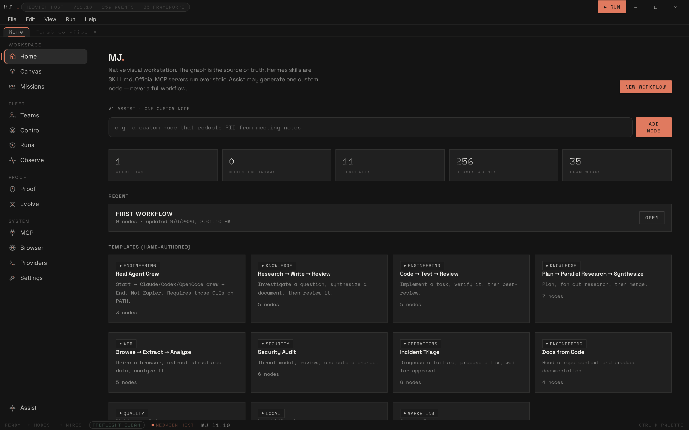
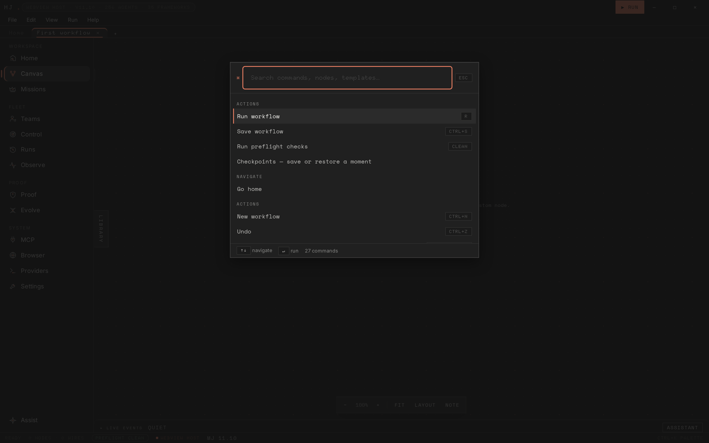
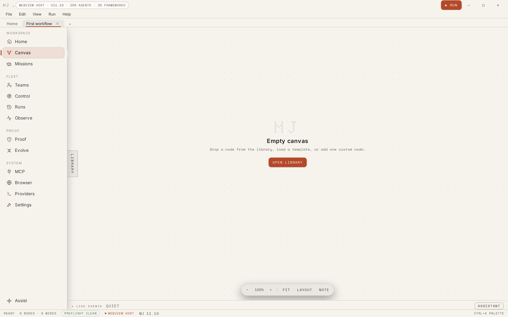

# Vouch Harbor 16.4.1 — the accountable agent OS (govern · execute · verify · learn)

> **The proof layer for agent work.** Vouch Harbor runs fleets of AI coding agents on your own machine and turns every mission into signed, independently verifiable evidence — the assurance runtime for the age of agent audits.

One product, one engine: you compose a crew, give it an outcome, and the
Mission Loop runs the whole agent-work cycle — dispatch, inter-agent
communication, gated execution, measured feedback, and human-approved
adaptation — leaving one signed, verifiable receipt per cycle. Before 12.0 the
app presented these as separate productions (Teams, Evolve, Missions, Mission
Control, Observe…). 12.0 merged them into a single runtime
(`src/mission/missionLoop.ts`) and one engine screen. 15.0 (the Vouch Harbor
face) made it six doors total: **Teammate · Mission Loop · Workflows · Proof ·
Audit · System**. 16.0 fused the two codebases into this product; 16.1 carries
one clean product line — the same single version stamps the engine, the
control plane, the proof protocol and the native shell — and adds the learning
bridge (M4) and the mission timeline (M5-lite). 16.2 adds the MCP capability
router (M3): any MCP client can list and call the product's capabilities
over stdio, and every call is routed through the same governed pipeline —
risky calls pause at the human gate, and every completed call mints a
receipt. 16.3 closes the roadmap with the gated, reversible meta-loop
(M6): the product can propose changes to its own control plane — risk
tiers and standing preferences — and every self-change is proposed in
words, simulated, human-gated, receipt-vouched and revertible (tighten
only; reverts are themselves gated). 16.4.0 closes the external-validation
gap with the drill: standard real missions — a fresh real git repo, the
repo's OWN test command, the real mission loop — run on demand, with the
verdict vouched and an attestation digest.

The Teammate door is the human front: a named, persistent Vouch seat you
message like a colleague — real tools, a human gate that pauses for approval
on risky actions, a signed receipt for every finished run, and — new in 16.1 —
it *learns*: a successful, verified mission distills into a test-gated skill,
and the next matching mission fast-paths on it, still paused at the human
gate.

## What it is

- **One engine, one cycle** — COMPOSE → DISPATCH → COMMUNICATE → EXECUTE →
  GATE → ADAPT runs as a single loop: the bandit router picks the run's
  strategy arms, dispatches every seat over the inter-agent bus, executes the
  team through the governance arena and budget ledger, and folds the measured
  report back through seat evolution (human-gated candidates), elastic
  scaling and lesson memory. One cycle = one signed receipt.
- **Learning bridge (16.1)** — a completed, verified mission trajectory
  distills into a vouched dispatch skill: real mission provenance (mission
  ID, verified seats), a replay gate that refuses too-coarse triggers, and a
  fast path that binds the skill into the next run's receipt. Failures land
  in failure memory; a failed replay flags the skill so it never
  auto-executes again.
- **Mission timeline (16.1)** — every dispatched mission opens into its
  unified chain: mission events plus the session and verdict bookends, as a
  phase-by-phase timeline. One mission, one chain, one state.
- **MCP capability router (16.2)** — `npm run mcp` serves the product's
  capabilities as an MCP server (JSON-RPC 2.0 over stdio): 19 governed
  tools, honest risk labels in the schema, risky calls non-blocking at the
  human gate (approve/deny from the UI or the server itself, then poll
  `call_status`), and a receipt minted for every completed call — success,
  denial, refusal or error — carrying the calling face's origin. The
  router is aligned with the MCP 2026-07-28 spec direction: stateless,
  self-describing requests, explicit handles, poll-based long-running
  work. `probe/mcpRouter` drives the real server over real stdio.
- **Gated, reversible meta-loop (16.3)** — the product proposes changes
  to its own control plane (`risk.tier` tighten-only, `preference.set`),
  each one proposed in words, simulated, paused at the human gate (the
  revert is gated too), receipt-vouched in every outcome, and reversible
  with the exact state restored. Behavior-pinned: a re-tiered tool
  actually pauses at the gate until reverted. Faces: System → Meta loop
  (ledger + intents; decisions on the one gate) and MCP
  (`meta_propose` / `meta_status` / `meta_revert`). What it cannot
  self-modify — the receipt protocol, the gate, the brain, the code — is
  stated in the code and the docs.
- **The drill (16.4)** — the product proving itself on real missions:
  `guard` (fix the disabled-admin bug), `maths` (implement the missing
  `clamp`), `impossible` (must come back FAILED — never a fake pass).
  Each run is a fresh REAL git repo whose OWN test command decides,
  through the REAL mission loop (real governance arena, real worktrees,
  signed cycle receipt), with a vouched drill report + reproducible
  attestation digest, a unified mission-ledger entry, and — because it is
  a mission — the human gate. Faces: System → Drill and MCP
  (`run_drill`, 20 governed tools).
- **25 harnesses, no lock-in** — 23 CLIs (claude, codex, gemini, grok,
  cursor, opencode, amp, …) plus `hermes` and `llm`, from one shared
  registry; install detection and argv policy cannot drift.
- **Verification first** — exit-code-first verdicts, measured cost
  (`unmeasured` rather than estimated), canary-proven sandbox wrappers, and
  an adversarial arena that must PASS before a run is admitted.
- **Communication as infrastructure** — every dispatch and seat event rides
  the inter-agent bus on role channels, visible live in the engine screen.
- **Gated merges** — the merge executor runs the plan's real git steps and
  refuses anything the gate blocked without a recorded human override; on a
  host without git it reports `simulated` instead of claiming a merge.
- **Proof receipts** — every cycle exports a SHA-256 hash-chained receipt,
  Ed25519-signed, verifiable with zero product state. New receipts ride the
  `vh-proof-receipt/2` wire; pre-16.1 receipts (`mj-proof-receipt/1|2`) still
  verify through the same open verifier — compatibility, not branding. The
  Evidence Pack bundles receipts, merge attestations, an AIBOM and a control
  crosswalk (EU AI Act / ISO 42001 / SOC 2).
- **Verify anywhere — the open verifier (14.0)** — `node tools/verify-receipt.mjs receipt.jsonl` re-checks any
  receipt's chain, seal and Ed25519 signature with zero dependencies and zero
  product state; auditors run it on a machine that never installed this
  product. Broken chains print the exact seq; nothing is laundered.
- **Agent FinOps — measured chargeback (14.0)** — per-team, per-mission chargeback rows built from the budget
  ledger's real settlements and exported as digest-stamped CSV; seats that reported only tokens stay
  `unmeasured`, simulated seats are never charged (`src/mission/finOps.ts`).
- **Assurance Score & incident black box (14.0)** — a 0–100 evidence-derived rating per team (verification
  mix, arena, budget discipline, egress integrity, human feedback) that refuses to exist without measured
  runs, and a one-file tamper-evident forensic dossier for any mission with a SIEM JSONL projection
  (`src/mission/assuranceScore.ts`, `src/mission/incidentDossier.ts`).
- **Adaptation with a human gate** — the loop proposes, people dispose: seat
  instruction candidates grounded in measured evidence, bandit arm updates
  from measured runs only, elastic seat suggestions, and a lesson memory that
  shapes future briefings. Simulated runs and predictions teach nothing about
  real execution; nothing the loop learns edits a team silently in SUGGEST.
- **Explicit human feedback on every cycle** (12.1.1) — each cycle in the
  ledger carries a 1–5 rating + comment panel; the rating queues on every
  seat that ran and the next fold turns it into real evidence (1–2 becomes
  weight-2 human evidence with the comment preserved, 4–5 arms praise
  suppression, 3 is neutral). Feedback is integrity-bound to the team that
  actually ran the cycle, and re-rating before the fold supersedes the
  unconsumed rating — the human's last word wins, nothing accumulates, the
  verbatim history keeps every submission. Only cycles that RAN are ratable:
  an aborted cycle (nothing executed) is refused outright, while a gate-FAIL
  cycle whose seats ran stays ratable — feedback belongs on the runs that
  went wrong. One engine over the engines of record — the model is one
  orchestrating runtime plus one cycle ledger, not a single physical store.
- **Knowledge Forge — documents → structured knowledge proposals** (12.1.1)
  — paste a document (a chapter, a runbook, a SKILL.md from a
  book-to-skill-style distiller) and the Knowledge Forge turns it into a
  candidate knowledge skill: a mechanical extractor for frameworks/decision
  rules that is fully local, optionally enhanced by an LLM pass through your
  own installed harness CLIs — disclosed plainly: that pass sends the document to the
  harness's configured model provider (cloud by default; a locally-configured
  model stays local), and every proposal records `dataHandling: local |
  provider`. Proposals carry real SHA-256 provenance and claim NO measured
  effect (approval is governance, not proof the book is right); you approve
  or discard, and approved knowledge rides future mission briefings as
  `[knowledge]` — the loop carries the book forward without pretending it
  measured it.
- **Native desktop, local first** — Tauri v2 (Rust) shell with SQLite, OS
  keychain and stdio child processes; the same frontend runs as a browser
  edition on any static host. State lives on the machine; nothing phones home.

## Screens

| Workflows | Proof vault |
|---|---|
|  |  |
| Design what the engine runs — typed ports, checkpoints, auto-layout | Signed receipt vault with self-audit, SIEM and evidence-pack export |

| Earlier surface (archived) | Command palette |
|---|---|
|  |  |
| Pre-12.0 pages (home, fleet board…) were consolidated into the Mission Loop screen; captures live in `media/` | Ctrl+K, fuzzy-ranked and grouped |

| Daylight theme | |
|---|---|
|  | Six INK palettes ship on true-black grounds — smoked apricot, dusty rose, whetstone, seedpod olive — with ivory and travertine as the paper-light pair. Design skills ship in `skills/` (ui-premium-craft, ui-motion-language, node-graph-craft) — ingestible through the Knowledge Forge. Ctrl+B collapses the sidebar. |

A full asset index — captures and the demo recording — lives in
[`media/`](media/README.md).

### Demo

[`media/demo-recording.mp4`](media/demo-recording.mp4) walks the pre-12.0
surface (home → canvas → fleet → proof); the 12.0 walkthrough is the Mission
Loop screen — compose a crew, run a cycle, watch the bus, gate the proposals,
read the receipts.

## Run it

```bash
# Node 22 + Rust stable
npm ci
npm run typecheck     # tsc --noEmit
npm test              # 88 suites
npm run build         # vite production build

npm run tauri dev     # desktop dev
npm run tauri:build   # nsis / dmg / appimage / deb

# offline verification, no node_modules needed (~30 s)
node verify/run.mjs   # 87 bundles
```

## Repository layout

```
src/         React frontend — the engine (mission/missionLoop.ts), the Vouch control plane (vouch/), six doors, canvas, harness registry
src-tauri/   Rust shell — Tauri commands, SQLite, keyring, MCP/ACP bridges, git
probe/       88 probe suites, run by `npm test`
verify/      offline pack — self-contained bundles + runner, byte-pinned
vendor/      reference MCP servers and the evolution service
docs/        verification notes, information architecture, per-release history
media/       screenshots and demo assets
```

## Verification

Every release is certified by the same four gates this README was written
against: `tsc --noEmit`, the live probe suites, the offline pack, and the
production build (see [docs/VERIFICATION.md](docs/VERIFICATION.md)). CI
repeats them on Linux, macOS and Windows, including `cargo
check`/`cargo test`/`clippy` on the real Tauri crate
(`.github/workflows/ci.yml`).

The typed command table in `src/ipc/client.ts` makes a renamed Rust command a
compile error, and a version-drift probe fails the build if manifests, docs,
counts or provenance metadata disagree with the code. The clean-identity
probe pins the 16.1 rebrand: no legacy product names anywhere in the routed
surface, `vouch.*` persistence keys only, and both wire generations
(current + legacy) still verifying.

## Documentation

- Desktop builds: [DESKTOP-NATIVE.md](DESKTOP-NATIVE.md), [BUILD-NATIVE.md](BUILD-NATIVE.md)
- Installing on a laptop: [INSTALL-ON-LAPTOP.md](INSTALL-ON-LAPTOP.md)
- Web deployment (Vercel): [DEPLOY-VERCER.md](DEPLOY-VERCEL.md)
- What Vouch Harbor wraps: [VENDOR.md](VENDOR.md) · [NOTICE](NOTICE)
- Release history: [CHANGELOG.md](CHANGELOG.md) and [docs/history/](docs/history/) — release notes 16.4.1: [docs/history/VH-16.4-UPGRADE.md](docs/history/VH-16.4-UPGRADE.md) · 16.3.0: [docs/history/VH-16.3-UPGRADE.md](docs/history/VH-16.3-UPGRADE.md) · 16.2.0: [docs/history/VH-16.2-UPGRADE.md](docs/history/VH-16.2-UPGRADE.md) · 16.1.0: [docs/history/VH-16.1-UPGRADE.md](docs/history/VH-16.1-UPGRADE.md)
- Problem map (what each feature exists to solve): [docs/PROBLEM-FOCUS.md](docs/PROBLEM-FOCUS.md)
- Information architecture (one product, one spine): [docs/INFORMATION-ARCHITECTURE.md](docs/INFORMATION-ARCHITECTURE.md)

## License

Source-available under **PolyForm Noncommercial 1.0.0** — free to run and
study; not for commercial products or model training. A commercial edition is
dual-licensed with signed-key desktop licenses
(`src/mission/licensing.ts`); vendored components ship under their own terms
([NOTICE](NOTICE), [VENDOR.md](VENDOR.md)).

---

Built by **Sree Harshen**. Feedback and pull requests welcome.
