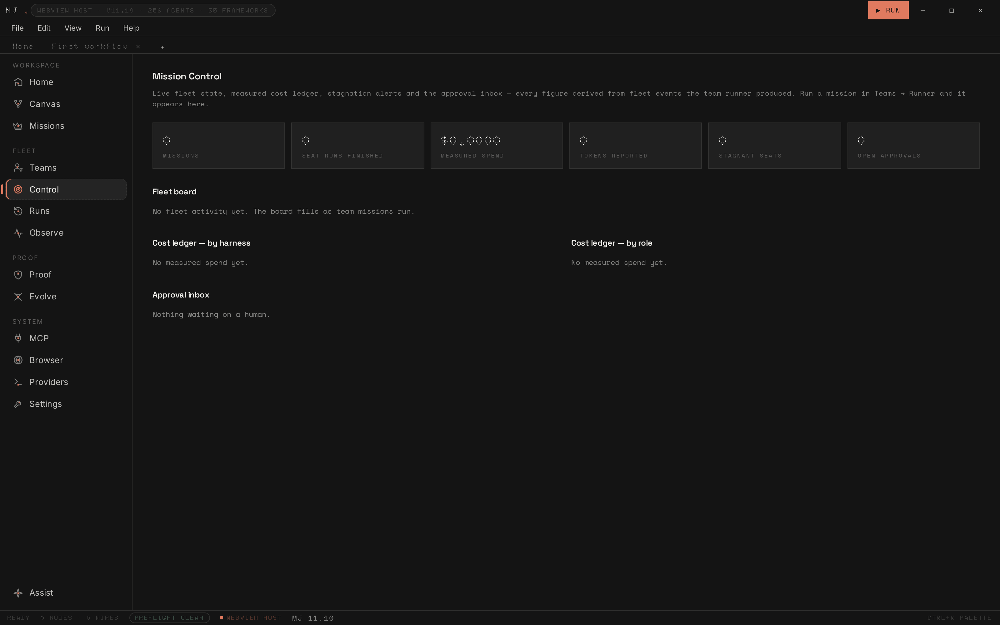

# MJ — Desktop runtime for agent organizations

MJ takes an outcome, plans the work, assigns the right agent harness to each seat,
checks whether the work actually happened, and keeps a signed, verifiable record of
the whole run.


## What it is

- **Native desktop** — Tauri v2 (Rust) shell with SQLite, OS keychain and stdio child
  processes; the same frontend also runs as a browser edition on any static host.
- **25 harnesses, no lock-in** — 23 CLIs (claude, codex, gemini, grok, cursor,
  opencode, amp, …) plus `hermes` and `llm`. Install detection and argv policy come
  from one shared registry so they cannot drift.
- **Verification first** — exit-code-first verdicts, measured cost (`unmeasured`
  rather than estimated), canary-proven sandbox wrappers, and an adversarial gate:
  a run is not verified unless a *different* harness than the writer checked it.
- **Gated merges** — the merge executor runs the plan's real git steps and refuses
  anything the gate blocked without a recorded human override; on a host without
  git it reports `simulated` instead of claiming a merge.
- **Proof receipts** — every mission can export a SHA-256 hash-chained receipt,
  Ed25519-signed, verifiable with zero MJ state. The Evidence Pack bundles receipts,
  merge attestations, an AIBOM and a control crosswalk (EU AI Act / ISO 42001 / SOC 2).
- **Self-evolving organization** — measured runs reflect into a lessons memory that
  shapes future team briefings; the strategy loop is a genuine online experiment
  (11.11.1): runs alternate between baseline and candidate, each run executes the
  parameters of the strategy that governs it, each arm is scored only on its own
  attributed runs, and adoption needs 3 measured runs per arm plus a strict margin.
  Skills learned from verified missions join briefings after human approval as
  procedural knowledge (node defs + briefing lines — not new tools); and everything
  the org learns is signed as a learning receipt. 11.12 adds the MOSAIC-Ω extract:
  a belief store (external claims never "known", contradictions surfaced), signed
  Action Packets that gate irreversible execution, causal memory edges — and the
  whole extract runs as a measured experiment arm (`mosaic` strategy dimension),
  so MJ adopts it only if attributed runs say it helps. Simulated runs and
  predictions teach nothing about real execution.
- **Local first** — state lives in SQLite or the browser's storage; nothing phones home.

## Screenshots

| Canvas | Mission Control |
|---|---|
|  |  |
| Visual workflow editor with typed ports and a closable library drawer | Live fleet board, measured cost ledger, approval inbox |

| Proof & Compliance | Command palette |
|---|---|
|  |  |
| Receipt vault with self-audit, SIEM and evidence-pack export | Ctrl+K, fuzzy-ranked and grouped |

| Daylight theme | |
|---|---|
|  | Fourteen palettes ship; `daylight` is the paper-light one. Ctrl+B collapses the sidebar. |

A full asset index — captures, the demo recording, the brief and the deck —
lives in [`media/`](media/README.md).

### Demo

[`media/demo-recording.mp4`](media/demo-recording.mp4) is a 29-second walkthrough of
this exact tree (home → canvas + library drawer → palette → fleet → proof), recorded
headless with a capture-time cursor overlay. The one-page product brief is
[`media/MJ-product-brief.pdf`](media/MJ-product-brief.pdf).

## Run it

```bash
# Node 22 + Rust stable
npm ci
npm run typecheck     # tsc --noEmit
npm test              # 64 suites
npm run build         # vite production build

npm run tauri dev     # desktop dev
npm run tauri:build   # nsis / dmg / appimage / deb

# offline verification, no node_modules needed (~25 s)
node verify/run.mjs   # 63 bundles
```

## Repository layout

```
src/         React frontend — pages, canvas, mission runtime, harness registry
src-tauri/   Rust shell — 94 Tauri commands, SQLite, keyring, MCP/ACP bridges, git
probe/       64 probe suites, run by `npm test`
verify/      offline pack — 63 self-contained bundles + runner, byte-pinned
vendor/      reference MCP servers and the evolution service
docs/        verification notes, per-release history
media/       screenshots and demo assets
```

## Verification

Every release is certified by the same four gates this README was written against:
`tsc --noEmit`, the live probe suites, the offline pack, and the production build
(see [docs/VERIFICATION.md](docs/VERIFICATION.md)). CI repeats them on Linux, macOS
and Windows, including `cargo check`/`cargo test`/`clippy` on the real Tauri crate
(`.github/workflows/ci.yml`).

The typed `MjCommands` table in `src/ipc/client.ts` makes a renamed Rust command a
compile error, and a version-drift probe fails the build if manifests, docs, counts
or provenance metadata disagree with the code.

## Documentation

- Desktop builds: [DESKTOP-NATIVE.md](DESKTOP-NATIVE.md), [BUILD-NATIVE.md](BUILD-NATIVE.md)
- Installing on a laptop: [INSTALL-ON-LAPTOP.md](INSTALL-ON-LAPTOP.md)
- Web deployment (Vercel): [DEPLOY-VERCEL.md](DEPLOY-VERCEL.md)
- What MJ wraps: [VENDOR.md](VENDOR.md) · [NOTICE](NOTICE)
- Release history: [CHANGELOG.md](CHANGELOG.md) and [docs/history/](docs/history/)

## License

Source-available under **PolyForm Noncommercial 1.0.0** — free to run and study;
not for commercial products or model training. A commercial edition is dual-licensed
with signed-key desktop licenses (`src/mission/licensing.ts`); vendored components
ship under their own terms ([NOTICE](NOTICE), [VENDOR.md](VENDOR.md)).

---

Built by **Sree Harshen**. Feedback and pull requests welcome.
